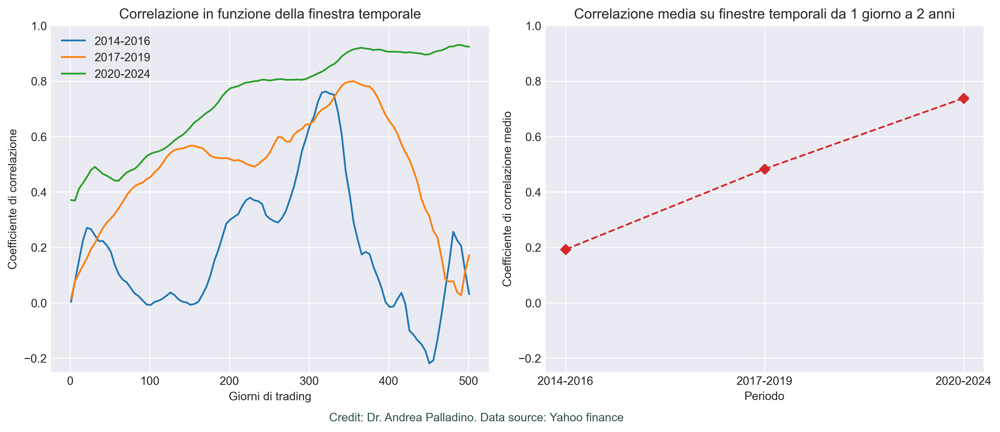
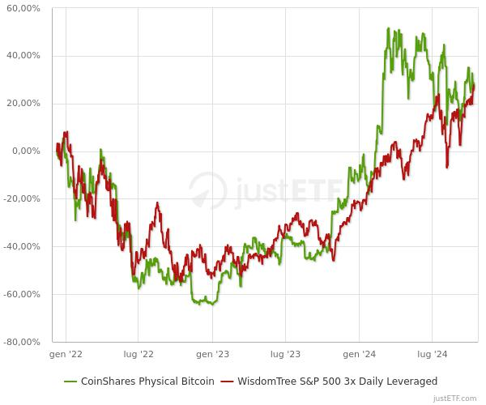

# BTC Correlations

This repository explores the evolution of correlations between Bitcoin (BTC) and the US stock market over time. The analysis reveals how Bitcoin has transitioned from being poorly correlated with the market to showing an almost perfect correlation with it in recent years.

## Installation

Follow these steps to clone the repository and set up the environment:

1. Clone the repository:
```
git clone git@github.com:apalladi/BTC-correlations.git
cd BTC-correlations
```

Create a Python virtual environment:
```
python -m venv .env
```

Activate the virtual environment:

On Linux/MacOS:
```
source .env/bin/activate
```

Install the required dependencies:
```
pip install -r requirements.txt
```

## Overview
This project focuses on analyzing the relationship between Bitcoin and the US stock market. Using historical price data, we compute the evolution of correlations between Bitcoin and major US stock indices (e.g., S&P 500, Nasdaq).

The methodology involves calculating rolling returns over varying time windows and assessing how the average correlations change across time.

## Results
The results of the analysis highlight the changing dynamics of Bitcoin's relationship with traditional financial markets:

- Early Period: Bitcoin showed very low or negligible correlation with the US stock market, behaving as an independent asset.
- Recent Trends: Bitcoin now exhibits a big correlation with the US stock market, suggesting that its behavior has become increasingly tied to broader market movements.



These findings provide insights into Bitcoin's evolution from a niche, independent asset to one that closely follows the market trends of traditional financial instruments, as we can see in the figure below, where Bitcoin is compared with an ETF 3x on S&P500.


